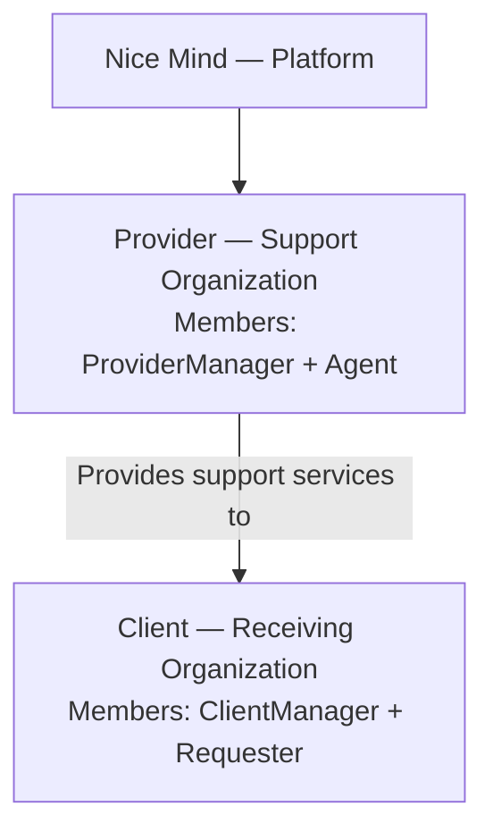
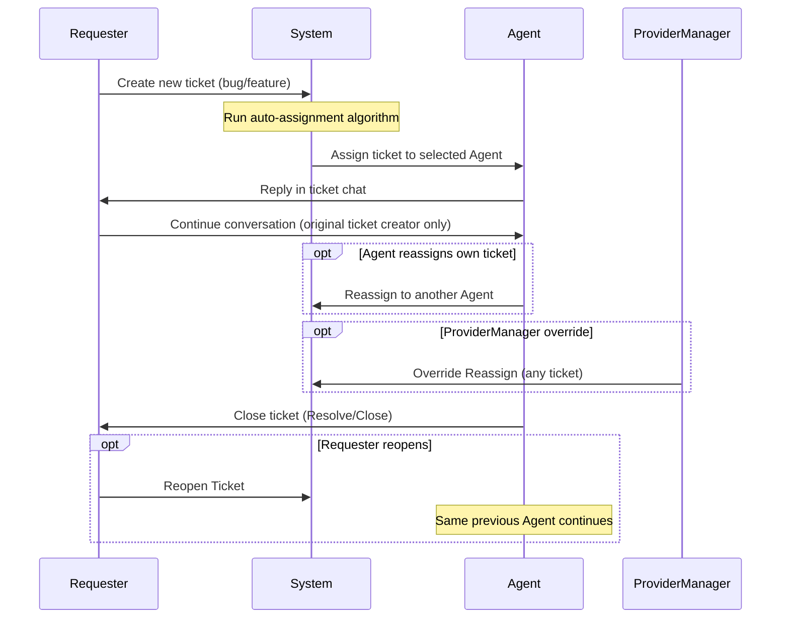
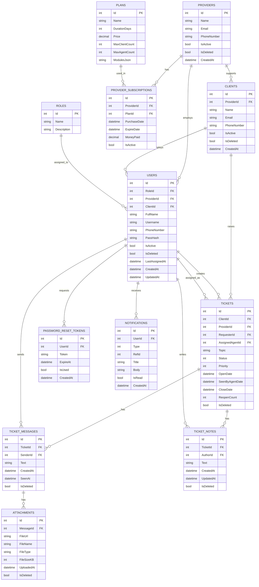

# 🎫 Ticketing System — FINAL Design v6 (Definitive Reference)

> **Status:** ✅ Final and definitive — this document is the primary project reference
> **This version replaces all previous versions (v1 through v5)**

---

## 📖 1. Final Glossary — preserving this table is critical


| Role/Concept      | Definition                                                                 |
| ----------------- | -------------------------------------------------------------------------- |
| **Provider**      | Direct Nice Mind customer organization; provider of technical support services |
| **Client**        | Organization that receives support services from a Provider                |
| **SuperAdmin**    | Nice Mind team; manages the entire platform                                |
| **ProviderManager** | Manager of a Provider organization; manages Agents and Clients           |
| **Agent**         | Provider support staff who respond to tickets                              |
| **ClientManager** | Manager of a Client organization; supervisory role only, no ticket involvement |
| **Requester**     | Client employee who creates tickets (bug fix / feature requests)           |


> 💡 `Provider`/`Client` and `Agent`/`Requester` were deliberately chosen without visual similarity to eliminate confusion risk in code.

---

## 🏢 2. Final Business Model




### 🔄 One-Way Ticket Flow




> ⚠️ Only `Requester` creates tickets and sends messages in chat. `ClientManager` never enters chat. Other `Requester`s within the same Client can only **view** each other's tickets (Read-only), not send messages.

---

## 🎯 3. Final Architecture Decisions (Complete)


| #   | Topic                                  | Decision                                                        |
| --- | -------------------------------------- | --------------------------------------------------------------- |
| 1   | Business model                         | Two layers: Provider → Client; fully one-way ticket flow        |
| 2   | Multi-tenancy                          | Shared Database + filter on `ProviderId` and `ClientId`         |
| 3   | Delete Strategy                        | Soft Delete everywhere (`IsDeleted`)                            |
| 4   | Ticket assignment                      | Automatic (algorithm in Section 6)                              |
| 5   | Reassignment                           | Agent: own tickets only; ProviderManager: all (Override)        |
| 6   | Real-time Chat                         | Polling for now                                                 |
| 7   | General AuditLog                       | Outside MVP                                                     |
| 8   | GetAll Contract                        | All GetAll endpoints: Search + Pagination                       |
| 9   | Escalation / internal Client layer     | ❌ Removed                                                      |
| 10  | CompanyUser role                       | ❌ Removed                                                      |
| 11  | Ticket chat participation              | Only original creator (Requester) sends messages; others Read-only |
| 12  | Reopen Ticket                          | Same previous Agent remains responsible (algorithm not re-run)  |
| 13  | Assignment history (`TicketAssignmentLogs`) | ⏸️ **Deferred to Phase 2**                                 |


---

## 🗺️ 4. Final ERD Diagram (MVP)




> 📌 Compared to v5, the `TicketAssignmentLogs` table was removed from the main ERD and moved to the "Phase 2 Backlog" (Section 17).

---

## 📋 5. Detailed Table Definitions

### 5.1 `Providers`


| Field       | Type          | Description |
| ----------- | ------------- | ----------- |
| Id          | int (PK)      |             |
| Name        | nvarchar(200) |             |
| Email       | nvarchar(200) |             |
| PhoneNumber | nvarchar(20)  |             |
| IsActive    | bit           |             |
| IsDeleted   | bit           |             |
| CreatedAt   | datetime2     |             |


### 5.2 `Clients`


| Field       | Type          | Description |
| ----------- | ------------- | ----------- |
| Id          | int (PK)      |             |
| ProviderId  | int (FK)      |             |
| Name        | nvarchar(200) |             |
| Email       | nvarchar(200) |             |
| PhoneNumber | nvarchar(20)  |             |
| IsActive    | bit           |             |
| IsDeleted   | bit           |             |
| CreatedAt   | datetime2     |             |


### 5.3 `Roles`

**Final Seed Data:**

```
1 - SuperAdmin
2 - ProviderManager
3 - Agent
4 - ClientManager
5 - Requester
```

### 5.4 `Users`


| Field          | Type                 | Description                                |
| -------------- | -------------------- | ------------------------------------------ |
| Id             | int (PK)             |                                            |
| RoleId         | int (FK)             |                                            |
| ProviderId     | int (FK, nullable)   | Roles 2, 3 only                            |
| ClientId       | int (FK, nullable)   | Roles 4, 5 only                            |
| FullName       | nvarchar(150)        |                                            |
| Username       | nvarchar(100)        | Unique                                     |
| PhoneNumber    | nvarchar(20)         |                                            |
| PassHash       | nvarchar(500)        |                                            |
| IsActive       | bit                  |                                            |
| IsDeleted      | bit                  |                                            |
| LastAssignedAt | datetime2 (nullable) | Agent only; used for Round-Robin algorithm |
| CreatedAt      | datetime2            |                                            |
| UpdatedAt      | datetime2            |                                            |


> ⚠️ **Domain constraint:** Exactly one of `ProviderId`/`ClientId` must have a value (except SuperAdmin, where both are null).

### 5.5 `Plans`


| Field          | Type          | Description |
| -------------- | ------------- | ----------- |
| Id             | int (PK)      |             |
| Name           | nvarchar(100) |             |
| DurationDays   | int           |             |
| Price          | decimal(18,2) |             |
| MaxClientCount | int           |             |
| MaxAgentCount  | int           |             |
| ModulesJson    | nvarchar(max) |             |


### 5.6 `ProviderSubscriptions`


| Field        | Type          | Description |
| ------------ | ------------- | ----------- |
| Id           | int (PK)      |             |
| ProviderId   | int (FK)      |             |
| PlanId       | int (FK)      |             |
| PurchaseDate | datetime2     |             |
| ExpireDate   | datetime2     |             |
| MoneyPaid    | decimal(18,2) |             |
| IsActive     | bit           |             |


### 5.7 `Tickets`


| Field           | Type                        | Description                                                                |
| --------------- | --------------------------- | -------------------------------------------------------------------------- |
| Id              | int (PK)                    |                                                                            |
| ClientId        | int (FK)                    |                                                                            |
| ProviderId      | int (FK)                    | denormalized                                                               |
| RequesterId     | int (FK -> Users)           | Original creator — only person who sends messages in this ticket           |
| AssignedAgentId | int (FK -> Users, nullable) | May remain Unassigned                                                      |
| Topic           | nvarchar(300)               |                                                                            |
| Status          | int (enum)                  | `Open=1, InProgress=2, PendingRequesterResponse=3, Resolved=4, Closed=5` |
| Priority        | int (enum)                  | `Low=1, Medium=2, High=3`                                                  |
| OpenDate        | datetime2                   |                                                                            |
| SeenByAgentDate | datetime2 (nullable)        |                                                                            |
| CloseDate       | datetime2 (nullable)        |                                                                            |
| ReopenCount     | int                         | Default 0                                                                  |
| IsDeleted       | bit                         |                                                                            |


### 5.8 `TicketMessages`


| Field     | Type                 | Description                          |
| --------- | -------------------- | ------------------------------------ |
| Id        | int (PK)             |                                      |
| TicketId  | int (FK)             |                                      |
| SenderId  | int (FK -> Users)    | Assigned Agent or creator Requester only |
| Text      | nvarchar(max)        |                                      |
| CreatedAt | datetime2            |                                      |
| SeenAt    | datetime2 (nullable) |                                      |
| IsDeleted | bit                  |                                      |


### 5.9 `Attachments`


| Field      | Type          | Description |
| ---------- | ------------- | ----------- |
| Id         | int (PK)      |             |
| MessageId  | int (FK)      |             |
| FileUrl    | nvarchar(500) |             |
| FileName   | nvarchar(300) |             |
| FileType   | nvarchar(50)  |             |
| FileSizeKB | int           |             |
| UploadedAt | datetime2     |             |
| IsDeleted  | bit           |             |


### 5.10 `TicketNotes`


| Field     | Type              | Description                                                              |
| --------- | ----------------- | ------------------------------------------------------------------------ |
| Id        | int (PK)          |                                                                          |
| TicketId  | int (FK)          |                                                                          |
| AuthorId  | int (FK -> Users) | Agent/ProviderManager only                                               |
| Text      | nvarchar(max)     | Internal note; never visible to Requester/ClientManager                  |
| CreatedAt | datetime2         |                                                                          |
| UpdatedAt | datetime2         |                                                                          |
| IsDeleted | bit               |                                                                          |


### 5.11 `PasswordResetTokens`


| Field     | Type          | Description |
| --------- | ------------- | ----------- |
| Id        | int (PK)      |             |
| UserId    | int (FK)      |             |
| Token     | nvarchar(200) |             |
| ExpireAt  | datetime2     |             |
| IsUsed    | bit           |             |
| CreatedAt | datetime2     |             |


### 5.12 `Notifications`


| Field     | Type                    | Description                                                                                                 |
| --------- | ----------------------- | ----------------------------------------------------------------------------------------------------------- |
| Id        | int (PK)                |                                                                                                             |
| UserId    | int (FK)                |                                                                                                             |
| Type      | int (enum)              | `NewTicketAssigned=1, NewMessage=2, TicketReassigned=3, TicketResolved=4, TicketClosed=5, TicketReopened=6` |
| RefId     | int (nullable)          |                                                                                                             |
| Title     | nvarchar(200)           |                                                                                                             |
| Body      | nvarchar(500, nullable) |                                                                                                             |
| IsRead    | bit                     |                                                                                                             |
| CreatedAt | datetime2               |                                                                                                             |


---

## 🤖 6. Auto-Assignment Algorithm (System Core)

### 6.1 Execution Point

Exactly once, immediately after `Create Ticket` by Requester.

### 6.2 Complete Logic (Pseudocode)

```
FUNCTION AutoAssignAgent(newTicket, providerId):

    activeAgents = Users.Where(
        RoleId == Agent AND
        ProviderId == providerId AND
        IsActive == true AND
        IsDeleted == false
    )

    IF activeAgents.IsEmpty():
        newTicket.AssignedAgentId = NULL   // Remains Unassigned
        LOG("No active agent available for Provider {providerId}")
        RETURN NULL

    openStatuses = [Open, InProgress, PendingRequesterResponse]

    FOR EACH agent IN activeAgents:
        agent.OpenTicketCount = Tickets.Count(
            AssignedAgentId == agent.Id AND
            Status IN openStatuses AND
            IsDeleted == false
        )

    // Priority 1: no open tickets at all
    freeAgents = activeAgents.Where(a => a.OpenTicketCount == 0)

    IF freeAgents.NotEmpty():
        candidates = freeAgents
    ELSE:
        // Priority 2: lowest open ticket count
        minCount = activeAgents.Min(a => a.OpenTicketCount)
        candidates = activeAgents.Where(a => a.OpenTicketCount == minCount)

    // Tie-Breaking: oldest LastAssignedAt wins (NULL = highest priority)
    selectedAgent = candidates.OrderBy(a => a.LastAssignedAt ?? DateTime.MinValue).First()

    newTicket.AssignedAgentId = selectedAgent.Id
    selectedAgent.LastAssignedAt = NOW()

    Notifications.Insert({
        UserId: selectedAgent.Id,
        Type: NewTicketAssigned,
        RefId: newTicket.Id
    })

    RETURN selectedAgent
```

### 6.3 Practical Example


| Agent | Current Open Tickets | LastAssignedAt |
| ----- | -------------------- | -------------- |
| Ali   | 3                    | 10:00          |
| Reza  | 0                    | 09:30          |
| Sara  | 0                    | Never (NULL)   |


- New ticket 1: `freeAgents=[Reza, Sara]` → Sara is selected (NULL is treated as oldest)
- New ticket 2 (after assignment above): `freeAgents=[Reza]` → Reza is selected
- New ticket 3: no one has zero → minimum between Reza and Sara (both 1) → Tie-break based on `LastAssignedAt`

---

## 🔀 7. Reassignment Rules


| Role                          | Can Reassign? | Constraints                                                                              |
| ----------------------------- | ------------- | ---------------------------------------------------------------------------------------- |
| **Agent**                     | ✅ Yes         | Only tickets where `AssignedAgentId == self`; only to another active Agent in same Provider |
| **ProviderManager**           | ✅ Yes (Override) | Any ticket within own Provider                                                       |
| **Requester / ClientManager** | ❌ No          | —                                                                                        |


### Sub-rules:

- After each Reassign, the new Agent's `LastAssignedAt` is updated.
- After Reassign, `SeenByAgentDate` is reset to `NULL`.
- A `TicketReassigned` notification is sent to the new Agent.
- Detailed history of these changes (who, when) will be added in Phase 2 via the `TicketAssignmentLogs` table (Section 17).

---

## 🔁 8. Reopen Ticket Rule

When the creating `Requester` reopens a ticket with status `Resolved`/`Closed`:

- `Status` returns to `Open`
- `ReopenCount += 1`
- `CloseDate = NULL`
- **`AssignedAgentId` does not change** — the same previous Agent who has full conversation context remains responsible (Auto-Assignment algorithm is not re-run)
- `SeenByAgentDate = NULL` (because there is a new message to view)
- A `TicketReopened` notification is sent to the same Agent

---

## 📖 9. Event Legend


| Symbol        | Event Type                                             |
| ------------- | ------------------------------------------------------ |
| 🔵 `[LIST]`   | GetAll — always with `search` + `pageNumber` + `pageSize` |
| 🟢 `[GET]`    | Retrieve a single item                                 |
| 🟡 `[SET]`    | Create new record                                      |
| 🟠 `[UPDATE]` | Edit / change status                                   |
| 🔴 `[DELETE]` | Soft Delete                                            |


---

## 🔑 10. Shared Pages and Events

### 10.1 Login


| Event         | Type          | Request              | Response                                                |
| ------------- | ------------- | -------------------- | ------------------------------------------------------- |
| Login         | 🟡 `[SET]`    | `username, password` | `accessToken, refreshToken, userId, roleName, fullName` |
| Refresh Token | 🟡 `[SET]`    | `refreshToken`       | `accessToken, refreshToken`                             |
| Logout        | 🟠 `[UPDATE]` | `refreshToken`       | `success`                                               |


### 10.2 Forgot / Reset Password


| Event               | Type       | Request              | Response  |
| ------------------- | ---------- | -------------------- | --------- |
| Request Reset       | 🟡 `[SET]` | `username`           | `success` |
| Submit New Password | 🟡 `[SET]` | `token, newPassword` | `success` |


### 10.3 Profile


| Event                 | Type          | Request                        | Response                                                    |
| --------------------- | ------------- | ------------------------------ | ----------------------------------------------------------- |
| Get Profile           | 🟢 `[GET]`    | —                              | `fullName, username, phoneNumber, roleName, orgName`        |
| Update Profile        | 🟠 `[UPDATE]` | `fullName, phoneNumber`        | `success`                                                   |
| Change Password       | 🟠 `[UPDATE]` | `currentPassword, newPassword` | `success`                                                   |
| Get Subscription Info | 🟢 `[GET]`    | —                              | `planName, expireDate, remainingDays` (ProviderManager only) |


### 10.4 Layout


| Event                         | Type       | Response                        |
| ----------------------------- | ---------- | ------------------------------- |
| Get Profile Summary           | 🟢 `[GET]` | `fullName, roleName, avatarUrl` |
| Get Unread Notification Count | 🟢 `[GET]` | `unreadCount`                   |


### 10.5 Notifications


| Event                  | Type          | Request                                      | Response                                              |
| ---------------------- | ------------- | -------------------------------------------- | ----------------------------------------------------- |
| Get Notifications List | 🔵 `[LIST]`   | `search?, pageNumber, pageSize, onlyUnread?` | `[{id, type, title, body, refId, isRead, createdAt}]` |
| Mark as Read           | 🟠 `[UPDATE]` | `notificationId`                             | `success`                                             |
| Mark All as Read       | 🟠 `[UPDATE]` | —                                            | `success`                                             |


---

## 🛡️ 11. SuperAdmin Area

### 11.1 Admin Dashboard


| Event              | Type       | Response                                                                                 |
| ------------------ | ---------- | ---------------------------------------------------------------------------------------- |
| Get Platform Stats | 🟢 `[GET]` | `totalProviders, activeProviders, totalClients, totalTicketsThisMonth, revenueThisMonth` |


### 11.2 Providers Manager


| Event               | Type          | Request                                                                       | Response                                               |
| ------------------- | ------------- | ----------------------------------------------------------------------------- | ------------------------------------------------------ |
| Get Providers List  | 🔵 `[LIST]`   | `search?, pageNumber, pageSize`                                               | `[{id, name, email, isActive, planName, clientCount}]` |
| Create Provider     | 🟡 `[SET]`    | `name, email, phoneNumber, managerUsername, managerFullName, managerPassword` | `providerId`                                           |
| Deactivate Provider | 🔴 `[DELETE]` | `providerId`                                                                  | `success`                                              |


### 11.3 Provider Detail


| Event      | Type          | Request                                          | Response                                                              |
| ---------- | ------------- | ------------------------------------------------ | --------------------------------------------------------------------- |
| Get Detail | 🟢 `[GET]`    | `providerId`                                     | `name, email, phone, isActive, subscription, clientCount, agentCount` |
| Update     | 🟠 `[UPDATE]` | `providerId, name, email, phoneNumber, isActive` | `success`                                                             |


### 11.4 Plans Manager


| Event           | Type          | Request                                                                 | Response                                                           |
| --------------- | ------------- | ----------------------------------------------------------------------- | ------------------------------------------------------------------ |
| Get Plans List  | 🔵 `[LIST]`   | `search?, pageNumber, pageSize`                                         | `[{id, name, price, durationDays, maxClientCount, maxAgentCount}]` |
| Create Plan     | 🟡 `[SET]`    | `name, durationDays, price, maxClientCount, maxAgentCount, modulesJson` | `planId`                                                           |
| Update Plan     | 🟠 `[UPDATE]` | all fields                                                              | `success`                                                          |
| Deactivate Plan | 🔴 `[DELETE]` | `planId`                                                                | `success`                                                          |


### 11.5 Subscriptions Manager


| Event                     | Type        | Request                            | Response                                                      |
| ------------------------- | ----------- | ---------------------------------- | ------------------------------------------------------------- |
| Get Subscriptions List    | 🔵 `[LIST]` | `providerId, pageNumber, pageSize` | `[{planName, purchaseDate, expireDate, moneyPaid, isActive}]` |
| Create/Renew Subscription | 🟡 `[SET]`  | `providerId, planId, moneyPaid`    | `subscriptionId, expireDate`                                  |


---

## 👔 12. ProviderManager Area

### 12.1 Home Dashboard


| Event               | Type       | Response                                                                                  |
| ------------------- | ---------- | ----------------------------------------------------------------------------------------- |
| Get Dashboard Stats | 🟢 `[GET]` | `totalClients, totalAgents, openTicketsTotal, closedTicketsTotal, unassignedTicketsCount` |


### 12.2 Agent Manager


| Event            | Type          | Request                                     | Response                                                                     |
| ---------------- | ------------- | ------------------------------------------- | ---------------------------------------------------------------------------- |
| Get Agents List  | 🔵 `[LIST]`   | `search?, pageNumber, pageSize`             | `[{id, fullName, username, isActive, openTicketsCount, closedTicketsCount}]` |
| Create Agent     | 🟡 `[SET]`    | `fullName, username, phoneNumber, password` | `userId`                                                                     |
| Deactivate Agent | 🔴 `[DELETE]` | `userId`                                    | `success`                                                                    |


### 12.3 Agent Detail


| Event            | Type          | Request                                   | Response                                           |
| ---------------- | ------------- | ----------------------------------------- | -------------------------------------------------- |
| Get Detail       | 🟢 `[GET]`    | `userId`                                  | `fullName, username, phoneNumber, isActive, stats` |
| Update           | 🟠 `[UPDATE]` | `userId, fullName, phoneNumber, isActive` | `success`                                          |
| Get Ticket Stats | 🟢 `[GET]`    | `userId`                                  | `openCount, closedCount, avgResponseTime`          |


### 12.4 Client Manager


| Event             | Type          | Request                                                                       | Response                                          |
| ----------------- | ------------- | ----------------------------------------------------------------------------- | ------------------------------------------------- |
| Get Clients List  | 🔵 `[LIST]`   | `search?, pageNumber, pageSize`                                               | `[{id, name, email, isActive, openTicketsCount}]` |
| Create Client     | 🟡 `[SET]`    | `name, email, phoneNumber, managerUsername, managerFullName, managerPassword` | `clientId`                                        |
| Deactivate Client | 🔴 `[DELETE]` | `clientId`                                                                    | `success`                                         |


### 12.5 Client Detail


| Event      | Type          | Request                                        | Response                                                    |
| ---------- | ------------- | ---------------------------------------------- | ----------------------------------------------------------- |
| Get Detail | 🟢 `[GET]`    | `clientId`                                     | `name, email, phone, isActive, requesterCount, ticketStats` |
| Update     | 🟠 `[UPDATE]` | `clientId, name, email, phoneNumber, isActive` | `success`                                                   |


---

## 🎧 13. Agent Area

### 13.1 Ticket List


| Event            | Type        | Request                                                            | Response                                                                       |
| ---------------- | ----------- | ------------------------------------------------------------------ | ------------------------------------------------------------------------------ |
| Get Tickets List | 🔵 `[LIST]` | `search?, status?, priority?, assignedToMe?, pageNumber, pageSize` | `[{id, topic, clientName, requesterName, status, priority, openDate, isSeen}]` |


### 13.2 Ticket Chat


| Event                          | Type          | Request                          | Response                                                                |
| ------------------------------ | ------------- | -------------------------------- | ----------------------------------------------------------------------- |
| Get Ticket Detail              | 🟢 `[GET]`    | `ticketId`                       | `topic, status, priority, clientName, requesterName, assignedAgentName` |
| Get Messages History           | 🔵 `[LIST]`   | `ticketId, pageNumber, pageSize` | `[{senderId, senderName, text, createdAt, seenAt, attachments[]}]`      |
| Send Message                   | 🟡 `[SET]`    | `ticketId, text, attachments?[]` | `messageId`                                                             |
| Mark as Seen                   | 🟠 `[UPDATE]` | `ticketId`                       | Sets `SeenByAgentDate`                                                  |
| Reassign Ticket                | 🟠 `[UPDATE]` | `ticketId, newAgentId`           | Only if `AssignedAgentId == self`                                       |
| Update Status                  | 🟠 `[UPDATE]` | `ticketId, newStatus`            | `success`                                                               |
| Update Priority                | 🟠 `[UPDATE]` | `ticketId, priority`             | `success`                                                               |
| Get Internal Notes             | 🔵 `[LIST]`   | `ticketId`                       | `[{authorName, text, createdAt}]`                                       |
| Add Internal Note              | 🟡 `[SET]`    | `ticketId, text`                 | `noteId`                                                                |
| Get Active Agents for Reassign | 🔵 `[LIST]`   | —                                | `[{id, fullName, openTicketsCount}]`                                    |


---

## 🏢 14. ClientManager Area (Supervisory Only)

### 14.1 Dashboard


| Event               | Type       | Response                                                |
| ------------------- | ---------- | ------------------------------------------------------- |
| Get Dashboard Stats | 🟢 `[GET]` | `totalRequesters, openTicketsTotal, closedTicketsTotal` |


### 14.2 Requester Manager


| Event                | Type          | Request                                     | Response                                                    |
| -------------------- | ------------- | ------------------------------------------- | ----------------------------------------------------------- |
| Get Requesters List  | 🔵 `[LIST]`   | `search?, pageNumber, pageSize`             | `[{id, fullName, username, isActive, ticketsCreatedCount}]` |
| Create Requester     | 🟡 `[SET]`    | `fullName, username, phoneNumber, password` | `userId`                                                    |
| Deactivate Requester | 🔴 `[DELETE]` | `userId`                                    | `success`                                                   |


### 14.3 Requester Detail


| Event      | Type          | Request                                   | Response                                                 |
| ---------- | ------------- | ----------------------------------------- | -------------------------------------------------------- |
| Get Detail | 🟢 `[GET]`    | `userId`                                  | `fullName, username, phoneNumber, isActive, ticketStats` |
| Update     | 🟠 `[UPDATE]` | `userId, fullName, phoneNumber, isActive` | `success`                                                |


### 14.4 Ticket List (Read-Only)


| Event                  | Type        | Request                                  | Response                                                            |
| ---------------------- | ----------- | ---------------------------------------- | ------------------------------------------------------------------- |
| Get All Client Tickets | 🔵 `[LIST]` | `search?, status?, pageNumber, pageSize` | `[{id, topic, requesterName, assignedAgentName, status, priority}]` |


> ⚠️ `ClientManager` has no `[SET]`/`[UPDATE]` events on Ticket.

---

## 👤 15. Requester Area

### 15.1 New Ticket


| Event         | Type       | Request                                  | Response                                                  |
| ------------- | ---------- | ---------------------------------------- | --------------------------------------------------------- |
| Create Ticket | 🟡 `[SET]` | `topic, text, priority?, attachments?[]` | `ticketId` — Auto-Assignment (Section 6) runs immediately |


### 15.2 Ticket List


| Event              | Type        | Request                                                | Response                                                   |
| ------------------ | ----------- | ------------------------------------------------------ | ---------------------------------------------------------- |
| Get Client Tickets | 🔵 `[LIST]` | `search?, status?, createdByMe?, pageNumber, pageSize` | `[{id, topic, requesterName, status, priority, openDate}]` |


> 📌 All Requesters within a Client have **view** access to each other's tickets (`createdByMe` filters to own tickets only).

### 15.3 Ticket Chat


| Event                | Type          | Request                          | Response                                                                                             |
| -------------------- | ------------- | -------------------------------- | ---------------------------------------------------------------------------------------------------- |
| Get Ticket Detail    | 🟢 `[GET]`    | `ticketId`                       | `topic, status, priority, assignedAgentName, requesterName`                                          |
| Get Messages History | 🔵 `[LIST]`   | `ticketId, pageNumber, pageSize` |                                                                                                      |
| Send Message         | 🟡 `[SET]`    | `ticketId, text, attachments?[]` | **Allowed only if `RequesterId == self`** (original creator); other Requesters cannot send, Read-only |
| Reopen Ticket        | 🟠 `[UPDATE]` | `ticketId`                       | Original creator only; only if Status=Resolved/Closed; per Section 8, same Agent remains             |


---

## 🔄 16. Complete Summary of All Decisions in This Version (v5 → v6)


| #   | Change                                                                      | Reason                                      |
| --- | --------------------------------------------------------------------------- | ------------------------------------------- |
| 1   | `TicketAssignmentLogs` table removed from MVP and moved to Phase 2 Backlog  | Team decision to simplify Phase 1           |
| 2   | Chat participation limited to original creator (Requester)                  | Definitive decision — prevent Agent confusion |
| 3   | Reopen rule finalized: same Agent remains, algorithm not re-run             | Approved proposal — preserve conversation context |


---

## 📦 17. Phase 2 Backlog (Outside Current MVP — For Later)


| Item                                 | Description                                                              |
| ------------------------------------ | ------------------------------------------------------------------------ |
| `TicketAssignmentLogs`               | Assignment/Reassign history table for debugging and detailed reporting     |
| General `AuditLogs`                  | Full logging of sensitive system changes                                 |
| Upgrade Polling to SignalR           | True real-time chat                                                      |
| Multi-participant ticket chat        | If needed later for multiple Requesters to message in one ticket         |
| Re-run algorithm on Reopen (optional) | If default behavior is changed later                                    |


---

## ✅ 18. Final Project Status (Sign-off)

This document is the **definitive and final** version of the database design, Auto-Assignment algorithm, and all events for every page. All key architectural decisions have been made and documented.

### ✅ Completed defined steps checklist:

- [x] Step 1: Review and refine initial database design
- [x] Step 2: Detailed design of events for each page based on final database
- [x] Define two-layer business model (Provider/Client)
- [x] Design Auto-Assignment algorithm
- [x] Define Reassignment and Reopen rules

### ➡️ Suggested next steps (implementation phase):

1. Detailed design of DTOs (Request/Response Models) for each Endpoint in C#
2. Design .NET project structure (layering: Clean Architecture recommended for this complexity)
3. Design Enums and Value Objects at the Domain level
4. Design Authorization Policies for each role (Policy-based Authorization)
5. Design detailed implementation of Auto-Assignment algorithm as a testable Domain Service (Unit Test)
